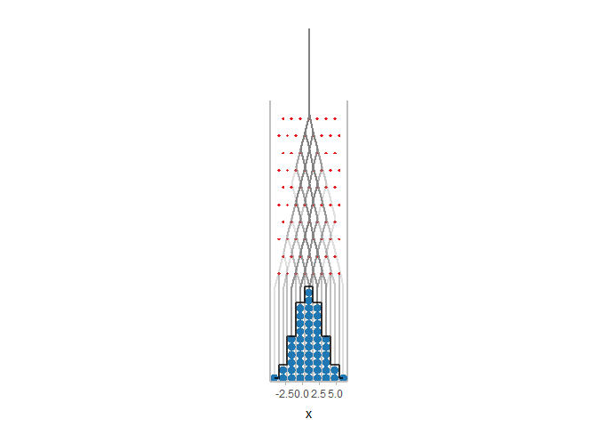

# plinko: Animated Plinko boards

<!-- badges: start -->

[](https://github.com/mjskay/plinko/actions)
[](https://codecov.io/github/mjskay/plinko?branch=master)
<!-- badges: end -->

`plinko` is an R package for creating animated Plinko boards (as known
as Galton boards, quincunxes, or bean machines). It helps determine
Plinko board parameters and generates plausible paths through a Plinko
board that result in a desired sample or set of quantiles, then renders
the Plinko board as an animated GIF or video.

## Installation

You can install plinko with:

``` r
# install.packages("remotes")
remotes::install_github("mjskay/plinko")
```

## Example

This example requires the following libraries:

``` r
library(plinko)
library(ggplot2)
library(distributional)
```

    ## Warning: package 'distributional' was built under R version 4.0.3

You can construct plinko boards using distributions from the
[distributional](https://pkg.mitchelloharawild.com/distributional/)
package:

``` r
dist = dist_normal(1,2)
board = plinko_board(dist, n_bin = 10)
autoplot(board)
```

<!-- -->
